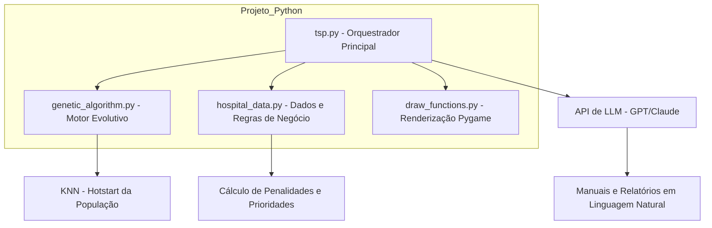
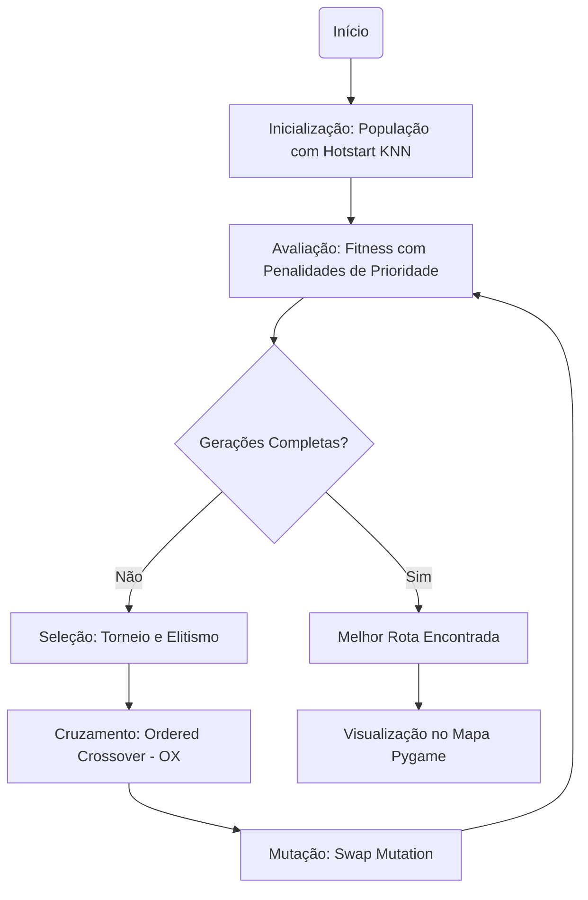
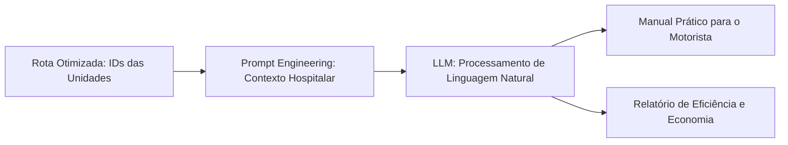

## 🎥 Demonstração do Projeto

> Veja o funcionamento completo do sistema (Streamlit + Pygame + CLI):

[Assista no YouTube](https://www.youtube.com/watch?v=LINKYOUTUBE)

---

## 📄 Relatório Técnico

📘 A documentação completa do projeto está disponível em:

👉 **[Acessar Relatório Técnico](/home/elisabete/git-repositórios/TSP-TECH-CHALLENGE-FASE-2/relatório_técnico/ech Challenge - Fase 2.docx)**

---

# 🚚 Otimizador de Rotas Médicas com Algoritmo Genético (2 Veículos)

Projeto acadêmico de otimização de rotas para distribuição médica, considerando múltiplos critérios:

- 📏 distância total percorrida;
- 🚨 prioridade de atendimento;
- 📦 capacidade do veículo;
- ⛽ autonomia máxima dos veículos.

A solução evolui o cenário de **1 veículo** para **até 5 veículos**, com divisão automática de entregas por **corte espacial dinâmico** e **integração com IA** para análise e instruções.

---

## 📌 Visão Geral

Este projeto busca minimizar o custo logístico de entregas partindo de um depósito (no código legado chamado de `hospital`), retornando ao depósito ao fim da rota.

Cada solução é avaliada com base em uma função de fitness multiobjetivo que combina:

1. distância;
2. prioridade;
3. capacidade;
4. autonomia.

---

## 🌟 Features Principais

### 🤖 Interface Inteligente (Streamlit)

- **Modo IA**: Descreva objetivos em linguagem natural e deixe a IA configurar parâmetros
- **Modo Manual**: Controle total sobre pesos e parâmetros do algoritmo
- **Chat com LLM**: Faça perguntas sobre as rotas geradas
- **Instruções Automáticas**: Geração de manuais para motoristas

### 🚚 Multi-Veículos

- Suporte para **1 a 5 veículos** simultâneos
- **Divisão espacial adaptativa** sem cortes fixos
- **Balanceamento automático** de cargas

### 📊 Análise Avançada

- **Evolução em tempo real** do fitness
- **Métricas detalhadas** por veículo
- **Relatórios de eficiência** gerados por IA
- **Penalidade de autonomia** para rotas realistas

### 🔧 Configuração Flexível

- **Variáveis de ambiente** para API keys
- **Configurações personalizáveis** via JSON
- **Integração com múltiplos LLMs** (OpenAI, groq)

---

## 🎯 Objetivo

Encontrar, por meio de Algoritmo Genético, rotas eficientes para dois veículos:

- Veículo 1: `depot -> a -> b -> c -> depot`
- Veículo 2: `depot -> d -> e -> f -> depot`

Com minimização de custo global:

- menor distância total;
- menor atraso de pontos críticos;
- menor violação de capacidade;
- menor violação de autonomia.

---

## 🧠 Estratégia de Modelagem

### 1) Representação

Cada indivíduo do AG representa uma ordem de visita das entregas.  
A partir dessa ordem, o sistema separa os pontos em duas rotas.

### 2) Split em Múltiplos Veículos (corte dinâmico)

A divisão de entregas usa lógica adaptativa (sem cortes fixos hardcoded):

1. Remove o depósito da lista de entregas;
2. Calcula dispersão espacial:
   - `dx = x - depot_x`
   - `dy = y - depot_y`
3. Escolhe o eixo com maior dispersão:
   - `std(dx) >= std(dy)` → corte vertical;
   - caso contrário → corte horizontal;
4. Usa **quartis do eixo escolhido** para divisão em N grupos:
   - Para 2 veículos: mediana (50%)
   - Para 3 veículos: 33% e 67%
   - Para 4 veículos: 25%, 50%, 75%
   - Para 5 veículos: 20%, 40%, 60%, 80%
5. Atribui os pontos:
   - Grupo 1: `<= quartil_1` → veículo 1
   - Grupo 2: `quartil_1 < x <= quartil_2` → veículo 2
   - ... (continua para N veículos)
6. Em caso degenerado (grupo vazio), aplica **redistribuição balanceada**.

✅ Vantagem: funciona para **1 a 5 veículos** mesmo se as coordenadas mudarem.

---

## 📐 Função de Fitness

A função de custo usada é:


fitness = w_{dist}\cdot D + w_{prio}\cdot P + w_{cap}\cdot C + w_{aut}\cdot A


Onde:

- `D`: distância total (`D_v1 + D_v2 + ...`);
- `P`: penalidade por atraso de prioridade;
- `C`: penalidade por excesso de capacidade;
- `A`: penalidade por violação de autonomia.

---

## ⚙️ Algoritmo Genético (decisões implementadas)

- **Seleção:** roleta ponderada por aptidão inversa (`1/fitness`);
- **Crossover:** Order Crossover (OX), apropriado para permutações;
- **Mutação:** troca de vizinhos (swap adjacente);
- **Elitismo:** melhor indivíduo preservado na nova geração.

---

## 🚀 Otimização de Desempenho

Foi utilizada **matriz de distâncias pré-computada** em vez de recalcular distância euclidiana a cada avaliação:

- `D[i][j] = distância entre cidade i e j`
- ganho de eficiência nas gerações do AG.

---

## 🧩 Estrutura do Projeto

- [genetic_algorithm.py](cci:7://file:///home/elisabete/git-reposit%C3%B3rios/TSP-TECH-CHALLENGE-FASE-2/genetic_algorithm.py:0:0-0:0) → núcleo do AG, fitness, split multi-veículos;
- [run_headless.py](cci:7://file:///home/elisabete/git-reposit%C3%B3rios/TSP-TECH-CHALLENGE-FASE-2/run_headless.py:0:0-0:0) → execução em modo console e saída estruturada;
- [app.py](cci:7://file:///home/elisabete/git-reposit%C3%B3rios/TSP-TECH-CHALLENGE-FASE-2/app.py:0:0-0:0) → interface Streamlit com IA integrada;
- [tsp.py](cci:7://file:///home/elisabete/git-reposit%C3%B3rios/TSP-TECH-CHALLENGE-FASE-2/tsp.py:0:0-0:0) → visualização com Pygame;
- `hospital_data.py` → prioridades, demandas, capacidade, autonomia;
- [schemas.py](cci:7://file:///home/elisabete/git-reposit%C3%B3rios/TSP-TECH-CHALLENGE-FASE-2/schemas.py:0:0-0:0) → configurações padrão e schema;
- `llm_client.py` → integração com LLMs (OpenAI, Claude);
- [draw_functions.py](cci:7://file:///home/elisabete/git-reposit%C3%B3rios/TSP-TECH-CHALLENGE-FASE-2/draw_functions.py:0:0-0:0) → renderização visual;
- `.env.example` → template de variáveis de ambiente;
- `config.json` → configurações padrão do sistema.

---

## ⚙️ Configuração

### Variáveis de Ambiente

Crie um arquivo `.env` com suas chaves de API:

```bash
# Copie o exemplo
cp .env.example .env

# Edite com suas chaves
OPENAI_API_KEY=sua_chave_aqui
GROQ_API_KEY=sua_chave_aqui
```

---

## ▶️ Como Executar

### 1) Criar ambiente

```bash
python -m venv venv
source venv/bin/activate
pip install -r requirements.txt
```

### 2) Streamlit

```bash
streamlit run app.py
```

### 3) Console (headless)

```bash
python run_headless.py
```

### 4) Visualização Pygame

```bash
python tsp.py
```
---

## 🚀 Comandos CLI para Reproduzir Análise
 
### 📊 Comparação: 1, 2, 3 Veículos
 
## Opção A: Via IA (objective)

**2 veículos** (padrão da LLM):

```bash
python run_headless.py --objective "Priorizar urgência mais que distância, garantir evolução do algoritmo" --out-json resultado_2v.json
```

---

## Opção B: Via config JSON (1, 2 e 3 veículos)

Crie os arquivos de config e execute:

**1. Criar `config_1v.json`:**

```bash
echo '{"n_vehicles": 1, "n_generations": 120, "mutation_prob": 0.35, "population_size": 100, "weights": {"distance": 0.2, "priority": 0.7, "capacity": 0.1}}' > config_1v.json
```

**2. Criar `config_2v.json`:**

```bash
echo '{"n_vehicles": 2, "n_generations": 120, "mutation_prob": 0.35, "population_size": 100, "weights": {"distance": 0.2, "priority": 0.7, "capacity": 0.1}}' > config_2v.json
```

**3. Criar `config_3v.json`:**

```bash
echo '{"n_vehicles": 3, "n_generations": 120, "mutation_prob": 0.35, "population_size": 100, "weights": {"distance": 0.2, "priority": 0.7, "capacity": 0.1}}' > config_3v.json
```

**4. Rodar as 3 otimizações:**

```bash
python run_headless.py --config-json config_1v.json --out-json resultado_1v.json
python run_headless.py --config-json config_2v.json --out-json resultado_2v.json
python run_headless.py --config-json config_3v.json --out-json resultado_3v.json
```

---

## Opção C: Tudo em sequência (1 comando)

```bash
echo '{"n_vehicles": 1, "n_generations": 120, "mutation_prob": 0.35, "population_size": 100, "weights": {"distance": 0.2, "priority": 0.7, "capacity": 0.1}}' > config_1v.json && \
echo '{"n_vehicles": 2, "n_generations": 120, "mutation_prob": 0.35, "population_size": 100, "weights": {"distance": 0.2, "priority": 0.7, "capacity": 0.1}}' > config_2v.json && \
echo '{"n_vehicles": 3, "n_generations": 120, "mutation_prob": 0.35, "population_size": 100, "weights": {"distance": 0.2, "priority": 0.7, "capacity": 0.1}}' > config_3v.json && \
python run_headless.py --config-json config_1v.json --out-json resultado_1v.json && \
python run_headless.py --config-json config_2v.json --out-json resultado_2v.json && \
python run_headless.py --config-json config_3v.json --out-json resultado_3v.json
```

---

### Comandos extras

**Com explicação da LLM ao final:**

```bash
python run_headless.py --config-json config_2v.json --out-json resultado_2v.json --explain
```

**Auto-tuning (2 iterações extras de ajuste via LLM):**

```bash
python run_headless.py --objective "Priorizar urgência" --auto-tune 2 --out-json resultado_tuned.json
```

**Usar provider OpenAI em vez de Groq:**

```bash
python run_headless.py --objective "Priorizar urgência" --llm-provider openai
```
---

## 🚀 **Saída esperada**

* **Evolução do fitness** por geração com gráfico interativo;
* **Rotas separadas** por veículo (até 5);
* **Chat inteligente** sobre as rotas geradas;
* **Instruções automáticas** para motoristas;
* **Relatório de eficiência** gerado por IA;
* **Métricas detalhadas:**
    * Fitness final;
    * Distância total e por veículo;
    * Penalidade de prioridade;
    * Penalidade de capacidade;
    * Penalidade de autonomia.
---

### 🧪 Limitações e Melhorias Futuras
* Comparar **corte dinâmico vs. KMeans (k=2)**;
* Testar **operadores de mutação** mais robustos (ex.: inversion, 2-opt);
* Adicionar **seed** para reprodutibilidade;
* Benchmark com instâncias maiores e mais veículos.

---

## 🗂️ Diagramas do Projeto
### 1. Diagrama de Arquitetura do Sistema

Este diagrama ilustra como os módulos do nosso projeto interagem entre si e com a IA Generativa.



### 2. Fluxograma do Algoritmo Genético Customizado

Este fluxo detalha o processo evolutivo, destacando o uso do KNN para a população inicial e as penalidades na função fitness




### 3. Diagrama de Fluxo de Dados com LLM

Mostra como a sequência de pontos otimizada é transformada nos entregáveis textuais exigidos pelo Tech Challenge




## ✅ Conclusão

O projeto entrega uma solução de **roteirização multiobjetivo com AG** para multiplos veículos, usando divisão espacial adaptativa e matriz de distâncias para eficiência.

A abordagem é consistente com o objetivo acadêmico e permite evolução para técnicas mais avançadas de clustering e refinamento de rotas.