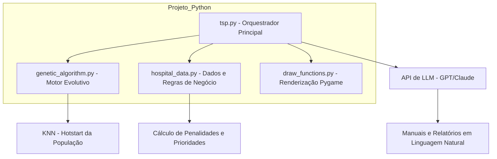
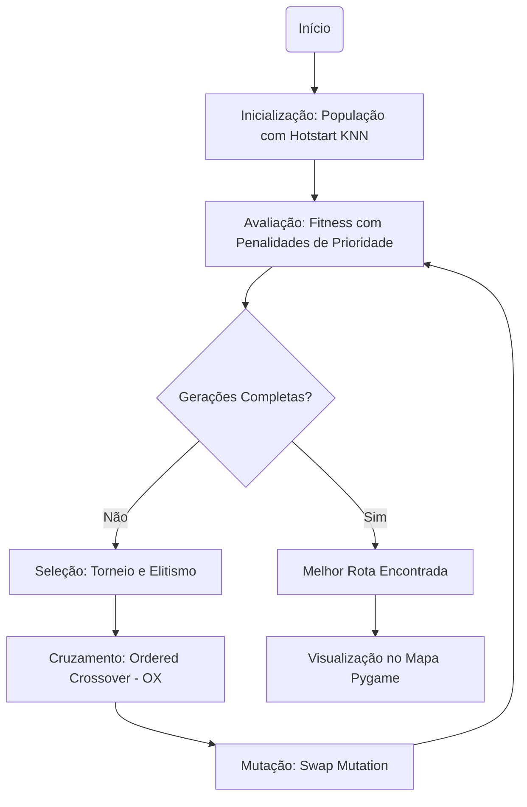
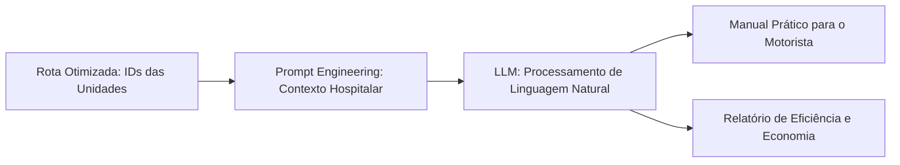

# 🧬 Tech Challenge – Fase 2  
## Otimização de Rotas Médicas com Algoritmos Genéticos

Este projeto faz parte do **Tech Challenge – Fase 2** e tem como objetivo desenvolver um sistema de **otimização de rotas para distribuição de medicamentos e insumos hospitalares**, utilizando **Algoritmos Genéticos** e **Inteligência Artificial (LLMs)** para geração de instruções e relatórios.

---

## 🎯 Objetivo do Projeto

Resolver um problema de **roteamento logístico hospitalar**, inspirado no problema do **Caixeiro Viajante (TSP)**, considerando restrições realistas como:

- Prioridade de entregas (medicamentos críticos x insumos regulares)
- Capacidade limitada dos veículos
- Autonomia máxima de distância
- Possibilidade de múltiplos veículos (VRP)
- Visualização das rotas otimizadas
- Geração de relatórios e instruções em linguagem natural com LLMs

---

## 🧠 Tecnologias Utilizadas

- Python 3.12
- Algoritmos Genéticos
- Machine Learning (KNN para Hotstart)
- pygame e matplotlib para visualização
- Integração com LLMs
- Ambiente virtual (venv)

---

## 📁 Estrutura do Projeto

```text
TSP-TECH-CHALLENGE-FASE-2/

├── tsp.py: Script principal que gerencia o fluxo do algoritmo e a interface visual.  
├── genetic_algorithm.py: Implementação do motor evolutivo, incluindo o Hotstart com KNN e operadores genéticos.  
├── hospital_data.py: Centraliza as coordenadas do hospital e a lógica de pesos e penalidades para a função fitness.  
├── draw_functions.py: Funções para renderização de cidades e rotas no Pygame.  
├── benchmark_att48.py: Conjunto de dados padrão para testes de performance do algoritmo.  

```
## 🗂️ Diagramas do Projeto
### 1. Diagrama de Arquitetura do Sistema

Este diagrama ilustra a modularidade do seu projeto e como o orquestrador principal integra a lógica de evolução, as regras de negócio e a IA Generativa.




### 2. Fluxograma do Algoritmo Genético Customizado

Este fluxo detalha o diferencial técnico do seu grupo: o uso de KNN para inicialização e a função fitness com penalidades clínicas (como emergências obstétricas e violência doméstica).



### 3. Diagrama de Fluxo de Dados com LLM

Este diagrama mostra como o seu sistema cumpre o requisito de transformar dados numéricos em instruções sensíveis ao contexto da saúde da mulher.

